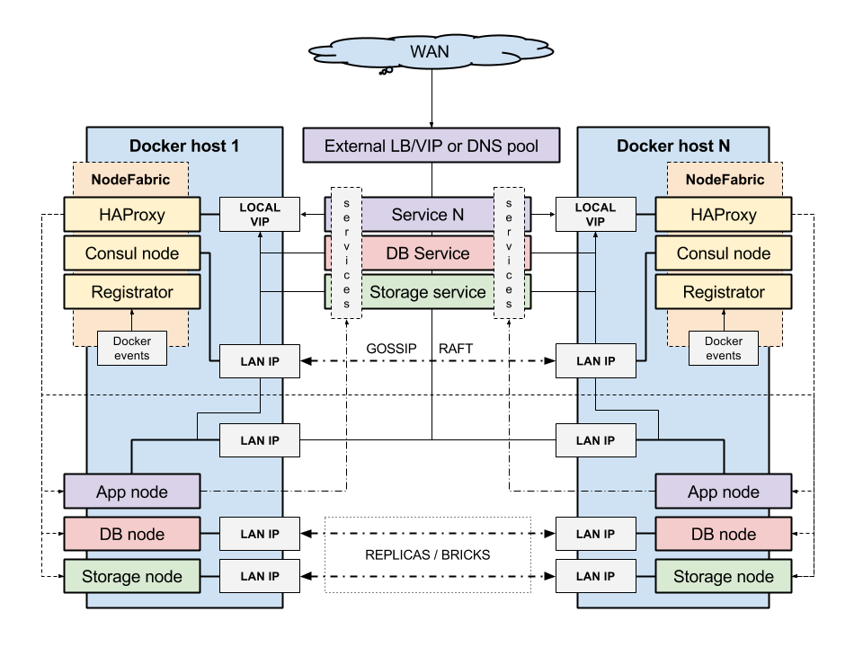

Overview
-------------------

NodeFabric Host Image is a modular system that contains NodeFabric Core Layer and "hosted" services - like MariaDB-Galera database and Ceph storage.
Supported modules (ie included services) are delivered as Docker containers and NodeFabric is essentially a Docker Host providing integration and coordination layer for them.

There are currently two types of NodeFabric Host Images being released:

- downloadable CentOS 7 based image build (in QCow2, VMDK, VHDX, VirtualBox OVA/VDI and Parallels PVM image output formats)
- RedHat Enterprise Linux based AMI available from Amazon EC2 cloud Marketplace

Docker containers that are included in the NodeFabric Host Image build:

- nf-consul, nf-registrator, nf-haproxy -- which are part of NodeFabric Core Layer services
- nf-galera implementing MariaDB-Galera service
- nf-ceph-mon (ceph cluster monitor) , nf-ceph-mds (ie CephFS) for Ceph storage services

The following diagram provider high-level architecture overview for the modular NodeFabric Host system:

NodeFabric Core Layer
+++++++++++++++++++++++

This is the highly available integration and coordination layer -- based on Consul, Registrator and HAProxy. It implements distributed cluster state database and manages internal service endpoints - driven by service discovery and built-in health checks. Inter-service communication can happen over these fault tolerant and load balanced localhost-like service endpoints. 

More about the Core Layer modules/containers and their roles:

- nf-consul: provides service discovery, health monitoring and distributed state database based on Consul (`<https://www.consul.io>`_)
- nf-registrator: implements Consul compatible service registry bridge for Docker (`<http://gliderlabs.com/registrator>`_)
- nf-haproxy: enables internal service endpoints, utilizing well-known HAProxy load-balancer (`<http://www.haproxy.com>`_)

About MariaDB-Galera service
++++++++++++++++++++++++++++

MariaDB-Galera Cluster is a synchronous multi-master database cluster - an enhanced, drop-in replacement for MySQL available under GPL v2 license.
It's developed by the MariaDB community with the MariaDB Foundation as its main steward.

MariaDB is a community-developed fork of the MySQL relational database management system and it is kept up to date with the latest MySQL release from the same branch and in most respects MariaDB will work exactly as MySQL. Being a fork of a leading open source software system, it is notable for being led by the original developers of MySQL, who forked it due to concerns over its acquisition by Oracle. All commands, interfaces, libraries and APIs that exist in MySQL also exist in MariaDB. There is no need to convert databases to switch to MariaDB. 

More info about MariaDB-Galera can be found here: https://mariadb.com/kb/en/mariadb/what-is-mariadb-galera-cluster/

About Ceph storage services
+++++++++++++++++++++++++++

Ceph is a distributed object store and file system designed to provide excellent performance, reliability and scalability. Ceph aims primarily to be completely distributed without a single point of failure, scalable to the exabyte level. Ceph replicates data and makes it fault-tolerant, using commodity hardware and requiring no specific hardware support. As a result of its design, the system is both self-healing and self-managing, aiming to minimize administration time and other costs.

More info about Ceph can be found here: 

- about CephFS: http://ceph.com/ceph-storage/file-system/
- about block storage (RBD): https://ceph.com/ceph-storage/block-storage/

Currently its block-level (RDB) and file-level (CephFS) interfaces are supported and available in NodeFabric. Althou Ceph monitors and metadata daemons are run within Docker containers, OSDs (Object Storage Daemons) are not. These are run directly in the host OS context - one OSD per each underlying Ceph data disk device. You need to provide and attach dedicated block devices to NodeFabric VM/host nodes that will be initialized as Ceph data disks at later stage. However you can decide on exact block devices attachment distribution (which disks to which hosts) and you can have multiple disks (and OSDs) on each and every NodeFabric node.  

About Docker, CentOS and RHEL
++++++++++++++++++++++++++++++++++++

NodeFabric Host Images utilize Docker linux containers technology for achieving modular and expandable architecture. User defined or third-party services can be loaded as additional docker containers and integrated with the NodeFabric Core Layer.

CentOS is a stable Docker Host platform derived from the sources of Red Hat Enterprise Linux (RHEL). NodeFabric Host Image itself is a slightly customized CentOS Docker Host build -- adding NodeFabric docker containers and Core Layer rpm packages -- while NodeFabric AMI is based on original RedHat Enterprise Linux distribution.

References: 

- https://www.docker.com/
- https://www.centos.org/
- http://www.redhat.com/en/technologies/linux-platforms/enterprise-linux
