Deploy
------

NodeFabric is distributed as a prebuilt VM (or bare-metal) host image -- which is used to deploy NodeFabric cluster nodes. As we are using quorum based clustering approach - total of 3 or 5 nodes are required to be deployed for successful operation. Exact cluster node count is depending on desired fault-tolerance factor - which can be 1 or 2 respectively.

There are two different NodeFabric Host Image builds released:

- RHEL 7 based AMI which is available from AWS Marketplace: https://aws.amazon.com/marketplace/pp/B015WKQZOM
- CentOS 7 Atomic Host based image - available in QCow2, Parallels Desktop PVM, VirtualBox OVA (and VDI) and VMWare VMDK formats -- and downloadable from: https://sourceforge.net/projects/opennode/files/NodeFabric/

Current deployment targets supported are: Amazon EC2, Openstack, VMWare, KVM, Parallels Desktop, VirtualBox and bare-metal.

In order to bootstrap NodeFabric cluster there are two options to choose from:

- zero-configuration "Boot-and-Go" mode (which requires cloud user-data);
- manual bootstrap procedure (ie supplying cluster hostmap and minimal config options)

Requirements and recommendations
+++++++++++++++++++++++++++++++++

General requirements:

- 3 or 5 cluster nodes - either VMs or bare-metal hosts; 
- at least 1GB of RAM per node;
- at least 10GB dedicated disk device per node for OS root;
- at least 64GB dedicated disk device per node for Ceph OSD data;
- at least 1x1Gbit network interface

Recommended cluster setup:

- 3 cluster nodes (for single node fault tolerance);
- 4GB or more RAM per node;
- 32GB OS root disk;
- 1x146GB or more Ceph data disks per each node (more and larger disks are always better, SSDs highly recommended for improved perfomance); 
- 10Gbit or Infiniband network fabric recommended for better perfomance (especially beneficial for Ceph);
- external load-balancer for services that need to be published for remote consumers 

.. note:: Depending on your deployment target you could use external load-balancers available in AWS, Openstack or in VMWare vSphere

.. note:: If you need higher fault tolerance factor than 1 -- then you need to deploy 5-node cluster (for FT=2 and sacrificing MariaDB-Galera write speed)
.. note:: 5-node clusters are not yet fully supported (althou they may work up to some extent)

User-data
+++++++++++++++++

NodeFabric Host Images can take advantage of cloud config metadata (ie user-data) -- in the target environments where it is available and supplied at boot time. It uses standard cloud-init package (for setting login ssh key / password, etc) together with custom nodefabric-cloudinit script (for NF specific options). User-data is used mainly for 2 things:

- activating instances ssh login credentials
- enabling "Boot-and-Go" mode for zero-configuration Core Layer bootstrap

Here is the full list of supported user-data (key=value based) options understood by nodefabric-cloudinit script:

.. csv-table::
   :header: "Parameter", "Description"
   :widths: 80, 250

   "ATLAS_TOKEN", "Atlas token string (required for Boot-and-Go mode)"
   "ATLAS_ENVNAME", "Environment name (required for Boot-and-Go mode)"
   "NODENAME", "Supply your predefined hostname (optional)"
   "SHARED_SECRET", "Consul Serf shared key (optional)"

.. note:: ATLAS_TOKEN can be obtained from: https://atlas.hashicorp.com/

.. note:: ATLAS_ENVNAME must be in the following format: <your_atlas_username>/<desired_deployment_name> (ie jdunlop/my-cluster). Environment itself will be auto-created in ATLAS when first node auto-registers with the service during boot-up.

.. note:: SHARED_SECRET can be generated as: 'openssl rand -base64 16'

.. note:: Current version of nodefabric-cloudinit script parses supported options from: http://169.254.169.254/latest/user-data

Obtaining ATLAS_TOKEN
************************

For creating an ATLAS token please do the following:

- register free account in https://atlas.hashicorp.com
- goto https://atlas.hashicorp.com/settings and choose "Tokens" from the left menu
- click on "Generate Token" button and copy/save the generated token string

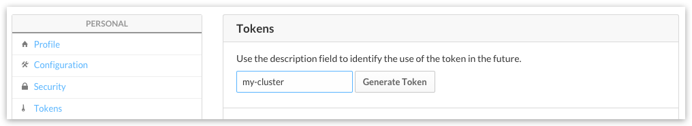

Pre-flight check
+++++++++++++++++

- You have suitable NodeFabric Host Image to boot from (either downloaded VM/host image or AMI ID for desired Amazon EC2 region)
- ATLAS_TOKEN (optional) - required for Core Layer remote auto-bootstrap service
- ATLAS_ENVNAME (optional) - required for Core Layer remote auto-bootstrap service
- SHARED_SECRET (optional) - required for Core Layer inter-communication encryption
- your ssh keypair - required for activating ssh login

Amazon EC2
+++++++++++++++++

Redhat Enterprise Linux based NodeFabric AMI is available from Amazon EC2 Marketplace (AWSMP). It's an EBS backed HVM AMI. You can deploy node instances by using AWS EC2 console (method #1, recommeded) OR directly from AWSMP NodeFabric product page (method #2). EC2 console method is the recommended option for NF AWS deployments - as it's launch wizard supports instance user-data input, additional storage configuration and launching multiple instances in one go. The benefit from the alternative AWSMP 1-Click deployment method is that it supplies you with auto-generated security group.

Here is the example deployment diagram for AWS EC2 (spanning over multiple Availability Zones): 

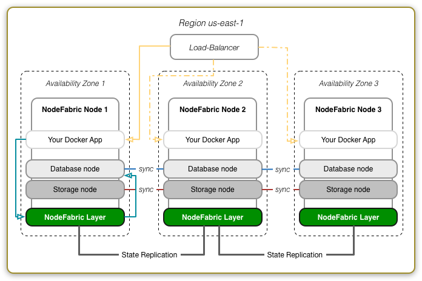

Method #1: EC2 Console (recommended)
*******************************************

Prebuilt NodeFabric AWS cloud images (AMIs) are available in all Amazon EC2 regions.
Please lookup image ID for your desired target region from the following table:

**NodeFabric-0.4.2 AMIs**

.. csv-table::
   :header: "Region", "ID"
   :widths: 80, 50

   "US East (N. Virginia)", "ami-7b86ff1e"
   "US West (Oregon)", "ami-bde9f18d"
   "US West (N. California)", "ami-399a5d7d"
   "EU (Frankfurt)", "ami-3c9d9e21"
   "EU (Ireland)", "ami-954961e2"
   "Asia Pacific (Singapore)", "ami-e86b7cba"
   "Asia Pacific (Sydney)", "ami-513e776b"
   "Asia Pacific (Tokyo)", "ami-b69805b6"
   "South America (Sao Paulo)", "ami-fb0397e6"

Search for public AMI ID under EC2 -> AMIs and launch it:

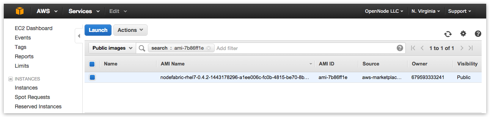

NodeFabric minimal instance type can be as low as: **t2.micro**. However instance types with more memory, faster storage and better networking speed are highly recommended:

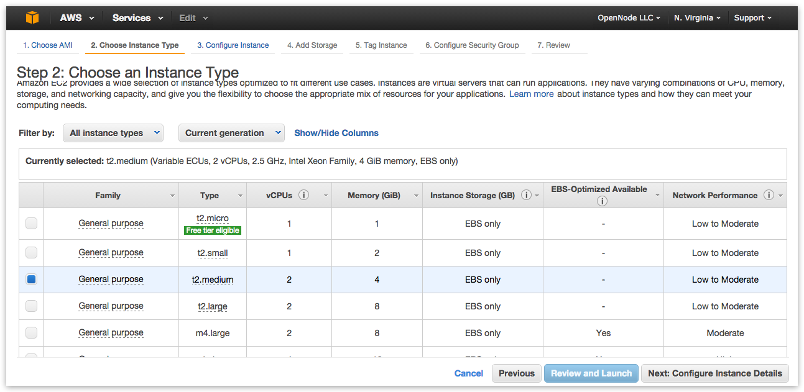

When configuring instance details set "Number of instances" to 3 (FT=1) or 5 (for FT=2) - following the NodeFabric cluster minimal size requirement:

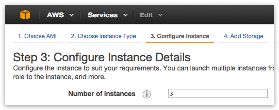

Please select default VPC and it's subnet - or create your own:

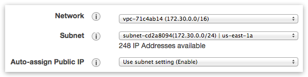

If you want to use zero-configuration "Boot-and-Go" mode then provide your ATLAS_TOKEN and ATLAS_ENVNAME under “Advanced Details -> User data”:

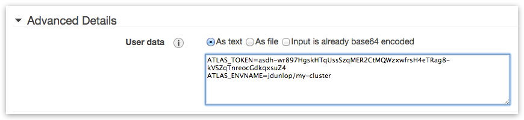

If you want to use Ceph storage solution then you need to add at least one additional storage volume (with minimal size of 64GB) per each instance -- which will be used for Ceph data disk:

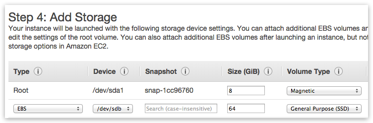

NodeFabric requires several open ports for cluster nodes (within LAN zone) inter-communication. Exact network ports are described in "Firewall ports" table within "Access" chapter of this guide. You can select default VPC Security Group allowing ALL traffic for now - but please do create proper Security Group with NodeFabric specific ruleset later. 

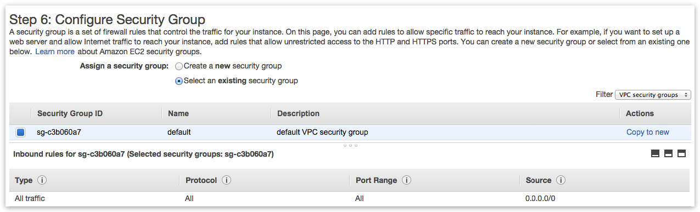

Review instances configuration and select your SSH key to be injected - and launch! Observe instance statuses until they are all up and running:

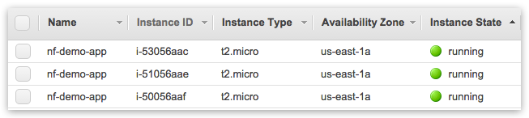

Method #2: 1-Click Launch from Marketplace
*******************************************

AWS Marketplace NodeFabric product page can be found here: https://aws.amazon.com/marketplace/pp/B015WKQZOM

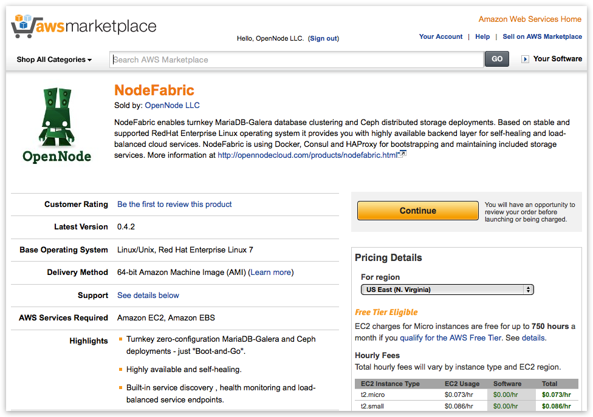

**Hint:** Click "Continue" button on product page :-)

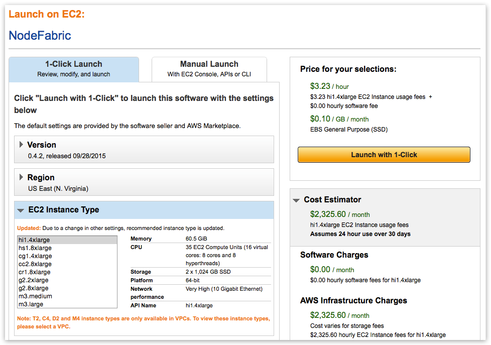

.. note:: First goto "VPC Settings" and create/select VPC instead of EC2 Classic - before picking instance flavor!

The reason behind this is that EC2 Classic instances won't preserve its internal subnet IPs after instance has been shut down. NodeFabric is a clustered solution - so it kind of depends on internal IPs being static - after it has been bootstrapped. NodeFabric will still work in EC2 Classic - but if you shut down one of the cluster nodes and its internal IP changes after that - it will be re-joining cluster as brand new node. So choosing VPC over EC2 Classic is highly recommended!

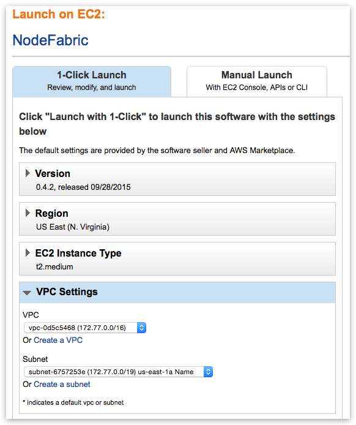

.. note:: Once you select VPC instead of EC2 Classic you get whole different list of available instance flavors as well!

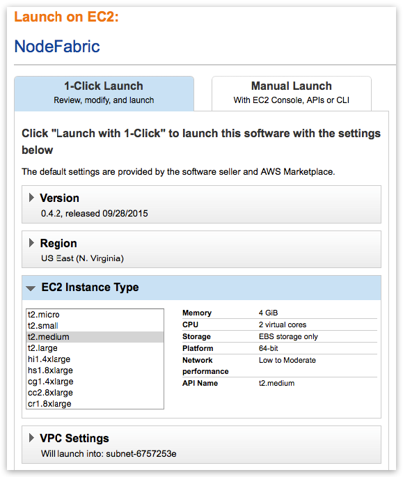

.. note:: Select AWSMP autogenerated Security Group which already comes with the suitable ruleset

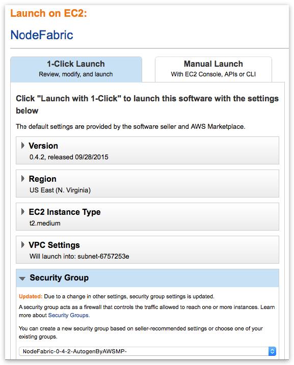

Now "Launch with 1-Click" and you are done! Well ... not really. You have to repeat this process for 2 more times in order to deploy total of 3 NodeFabric instances (in 3 separate Availability Zones perhaps). Also you would need to add volumes to the deployed instances for Ceph data disks at later stage. 

Openstack
+++++++++++++++++

TODO

.. parsed-literal::

    # Set NodeFabric image version to download
    NF_VERSION="\ |release|\ "

.. code-block:: bash

    # Download image
    curl -L -O http://downloads.sourceforge.net/project/opennode/NodeFabric/nf-atomic-${NF_VERSION}.qcow2.gz
    
    # Unpack image
    gunzip nf-atomic-${NF_VERSION}.qcow2.gz

    # Loading image to Glance catalog
    glance image-create --name="NodeFabric-${NF_VERSION}" --is-public=true \
	--min-disk 10 --min-ram 1024 --progress \
	--container-format=bare --disk-format=qcow2 \
	--file nf-atomic-${NF_VERSION}.qcow2

VMWare
+++++++++++++++++

TODO

.. parsed-literal::

    # Set NodeFabric image version to download
    NF_VERSION="\ |release|\ "

.. code-block:: bash

    # Download image
    curl -L -O http://downloads.sourceforge.net/project/opennode/NodeFabric/nf-atomic-${NF_VERSION}.vmdk.gz
    
    # Unpack image
    gunzip nf-atomic-${NF_VERSION}.vmdk.gz

Libvirt KVM
+++++++++++++++++

.. parsed-literal::

    # Set NodeFabric image version to download
    NF_VERSION="\ |release|\ "

.. code-block:: bash

    # Download image
    curl -L -O http://downloads.sourceforge.net/project/opennode/NodeFabric/nf-atomic-${NF_VERSION}.qcow2.gz

    # Download cloud-init iso
    curl -L -O http://downloads.sourceforge.net/project/opennode/NodeFabric/cloud-init.iso
    
    # Unpack 
    gunzip nf-atomic-${NF_VERSION}.qcow2.gz

    # Clone under libvirt disk images location for ALL cluster nodes
    for in `seq 1 3`; do rsync -av --progress nf-atomic-${NF_VERSION}.qcow2 /var/lib/libvirt/images/nf-node${i}.qcow2; done

    # Move cloud-init.iso into standard libvirt images location
    mv cloud-init.iso /var/lib/libvirt/images/

    # Launch node1
    virt-install \
    	--name=nf-node1 --memory=1024 --vcpus=1 \
	--disk=/var/lib/libvirt/images/nf-node1.qcow2,device=disk,bus=virtio \
	--cdrom /var/lib/libvirt/images/cloud-init.iso \
	--noautoconsole --vnc --accelerate --os-type=linux --os-variant=rhel7 --boot hd

    # Launch node2
    virt-install \
    	--name=nf-node2 --memory=1024 --vcpus=1 \
	--disk=/var/lib/libvirt/images/nf-node2.qcow2,device=disk,bus=virtio \
	--cdrom /var/lib/libvirt/images/cloud-init.iso \
	--noautoconsole --vnc --accelerate --os-type=linux --os-variant=rhel7 --boot hd

    # Launch node3
    virt-install \
    	--name=nf-node3 --memory=1024 --vcpus=1 \
	--disk=/var/lib/libvirt/images/nf-node3.qcow2,device=disk,bus=virtio \
	--cdrom /var/lib/libvirt/images/cloud-init.iso \
	--noautoconsole --vnc --accelerate --os-type=linux --os-variant=rhel7 --boot hd

Parallels Desktop
+++++++++++++++++

TODO

.. parsed-literal::

    # Set NodeFabric image version to download
    NF_VERSION="\ |release|\ "

.. code-block:: bash

    # Download image
    curl -L -O http://downloads.sourceforge.net/project/opennode/NodeFabric/nf-atomic-${NF_VERSION}.pvm.gz
    
    # Unpack image
    gunzip nf-atomic-${NF_VERSION}.pvm.gz

VirtualBox
+++++++++++++++++

TODO

.. parsed-literal::

    # Set NodeFabric image version to download
    NF_VERSION="\ |release|\ "

.. code-block:: bash

    # Download image
    curl -L -O http://downloads.sourceforge.net/project/opennode/NodeFabric/nf-atomic-${NF_VERSION}.ova.gz
    
    # Unpack image
    gunzip nf-atomic-${NF_VERSION}.ova.gz

Bare metal
+++++++++++++++++

TODO

.. parsed-literal::

    # Set NodeFabric image version to download
    NF_VERSION="\ |release|\ "

    # Set target disk device
    BLKDEV="/dev/sdb"

.. code-block:: bash

    # Download image
    curl -L -O http://downloads.sourceforge.net/project/opennode/NodeFabric/nf-atomic-${NF_VERSION}.qcow2.gz

    # Unpack 
    gunzip nf-atomic-${NF_VERSION}.qcow2.gz

    # Write image to physical disk device
    qemu-img convert test.qcow2 -O raw $BLKDEV