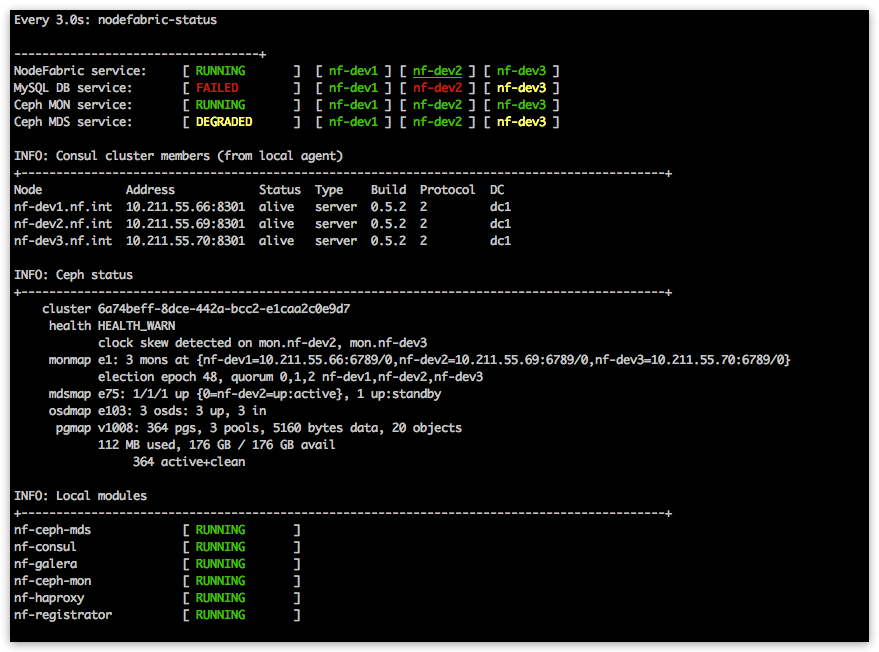
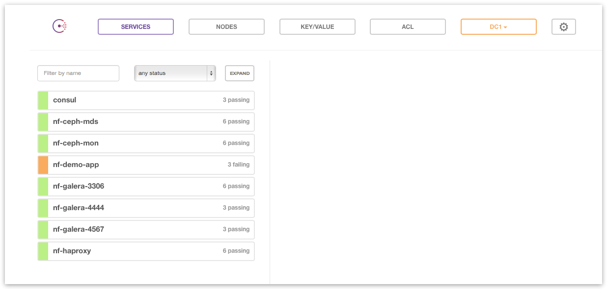
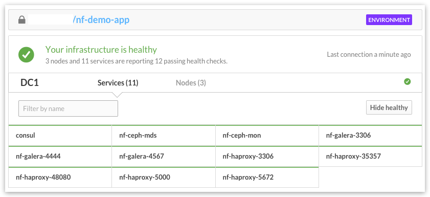
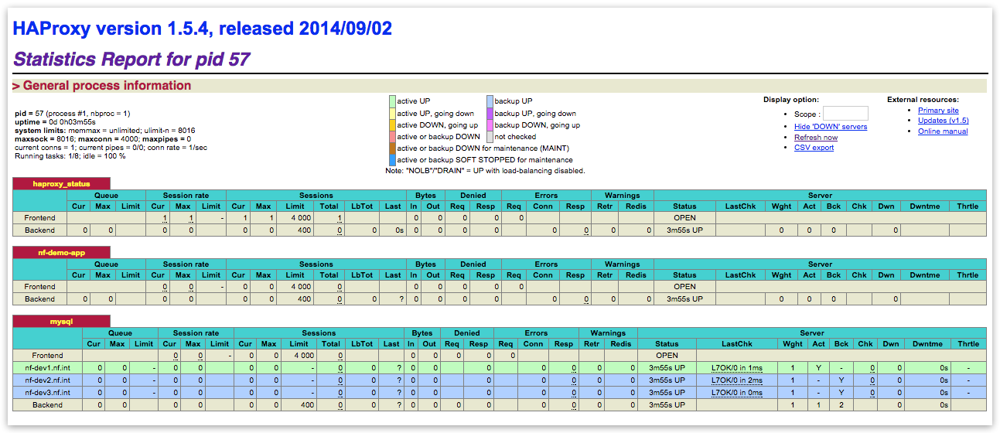

Manage
------

Dashboards
+++++++++++++++++++++++

There are several status dashboards available with NodeFabric:

- nodefabric-dashboard from SSH console
- local Consul web UI at: http://localhost:8500/ui/
- remote ATLAS dashboard at: https://atlas.hashicorp.com/<user>/environments/<envname>
- HAProxy web UI at: http://localhost:48080/

nodefabric-dashboard
********************

This default console based dashboard provides cluster-wide status overview across different NodeFabric service layers together with more detailed Consul membership and Ceph status boards. 

.. code-block:: bash
    
    # Run from arbitrary node console
    nodefabric-dashboard

Global services statuses are presented as RUNNING, DEGRADED or FAILED:

- **RUNNING** means that all nodes participating in service are OK;
- **DEGRADED** means that service has quorum and is operational - yet one or more nodes participating are failing;
- **FAILED** means that service has lost quorum and is not available

Service statuses on each node participating in a global service offering are colored as follows:

- **GREEN** means service is OK (ie passing health checks);
- **YELLOW** means that service module is not started;
- **RED** means that service module is started but not passing health checks (ie failing)

.. note:: Underlined node represents current Consul master  

Consul web UI
********************

This local web UI provides cluster-wide status overview about internal services (as they get registered in consul) and about their built-in health checks.
Editing support for Consul highly available Key-Value store is also included.

.. note:: Consul UI is only available from localhost (use ssh port forwarding for remote access)

.. code-block:: bash
    
    # Setup local port forwarding over SSH connection to Consul UI port
    NODE_IP="10.211.55.100"
    NODE_USER="centos"
    KEY_PATH=".ssh/id_rsa"
    ssh -L 8500:localhost:8500 -i ${KEY_PATH} ${NODE_USER}@${NODE_IP}
    
    # Load Consul UI in your web browser
    http://localhost:8500/ui/

ATLAS dashboard
********************

Remote counterpart for local Consul UI is provided by ATLAS service. Goto https://atlas.hashicorp.com/environments and login with your ATLAS user account for remote Consul dashboard:

HAProxy web UI
********************

HAProxy dashboard provides status info about internal load-balanced service endpoints.

.. note:: HAProxy web UI is only available from localhost (use ssh port forwarding for remote access)

.. code-block:: bash
    
    # Setup local port forwarding over SSH connection to HAProxy UI port
    NODE_IP="10.211.55.100"
    NODE_USER="centos"
    KEY_PATH=".ssh/id_rsa"
    ssh -L 48080:localhost:48080 -i ${KEY_PATH} ${NODE_USER}@${NODE_IP}
    
    # Load HAProxy UI in your web browser
    http://localhost:48080/

NF Core Layer
++++++++++++++++++++++

TODO

MariaDB-Galera service
++++++++++++++++++++++

TODO

.. code-block:: bash

   [root@nf-dev1 ~]# nf-galera-ctl help

   Usage:

     nf-galera cluster service management:

       nf-galera-ctl enable
       nf-galera-ctl disable
       nf-galera-ctl bootstrap

   Help:

       nf-galera-ctl help

Ceph storage services
++++++++++++++++++++++

TODO

.. code-block:: bash

   [centos@ip-172-30-0-100 ~]$ sudo nf-ceph-ctl help

   Usage:

     nf-ceph-mon cluster service management:

       nf-ceph-ctl enable
       nf-ceph-ctl disable
       nf-ceph-ctl bootstrap

     Help:

       nf-ceph-ctl help

.. code-block:: bash

   [centos@ip-172-30-0-100 ~]$ sudo nf-ceph-disk help

   Usage:

     OSD / Disk management:

       nf-ceph-disk list
       nf-ceph-disk status
       nf-ceph-disk init <blkdev>
       nf-ceph-disk activate <blkdev>

     Help:

       nf-ceph-disk help

.. code-block:: bash

   [centos@ip-172-30-0-100 ~]$ sudo nf-ceph-fs help

   Usage:

     CephFS management:

       nf-ceph-fs enable
       nf-ceph-fs disable
       nf-ceph-fs status
       nf-ceph-fs bootstrap
       nf-ceph-fs mount
       nf-ceph-fs umount

     Help:

       nf-ceph-fs help

Update
++++++++++++++++++++++

TODO
